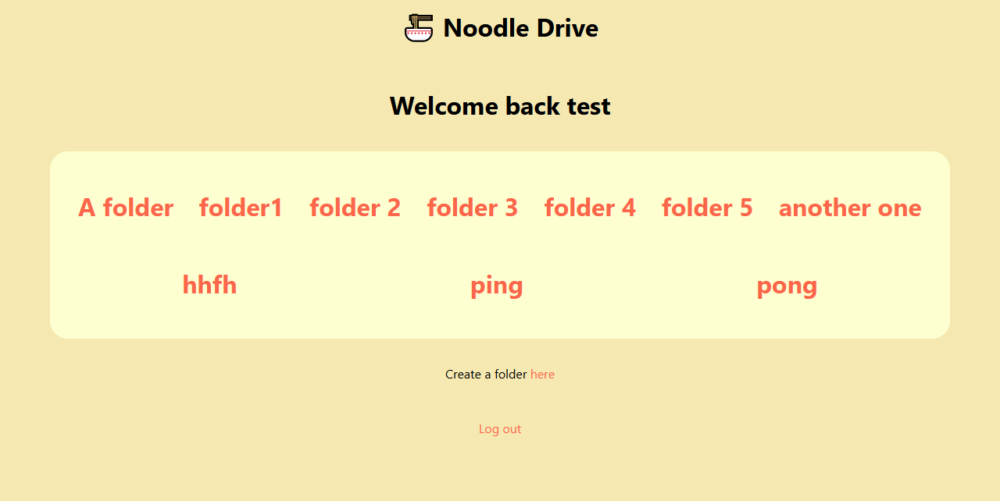

# Noodle Drive

A google drive clone that lets you register, log in and upload files to your folders.



## Installation

**You'll need a database and a cloudinary account to use this project.**

First make sure that you have a .env file formatted like this:

```
DATABASE_URL= YOURDATABASEURL
PORT = 8080
SESSION_SECRET= SOMESESSIONSECRET
CLOUDINARY_CLOUD_NAME = YOURCLOUDINARYNAME
CLOUDINARY_API_KEY = YOURCLOUDINARYAPIKEY
CLOUDINARY_API_SECRET = YOURCLOUDINARYAPISECRET
```

Make a database in the same format as the [schema](prisma/schema.prisma)

Then clone the repo and run the commands below on the project's directory to start the project.

```powershell
  npm install
  npm run start
```

## Credits

The emoji graphics are from the open source project Twemoji. The graphics are copyright 2020 Twitter, Inc and other contributors. The graphics are licensed under CC-BY 4.0.
